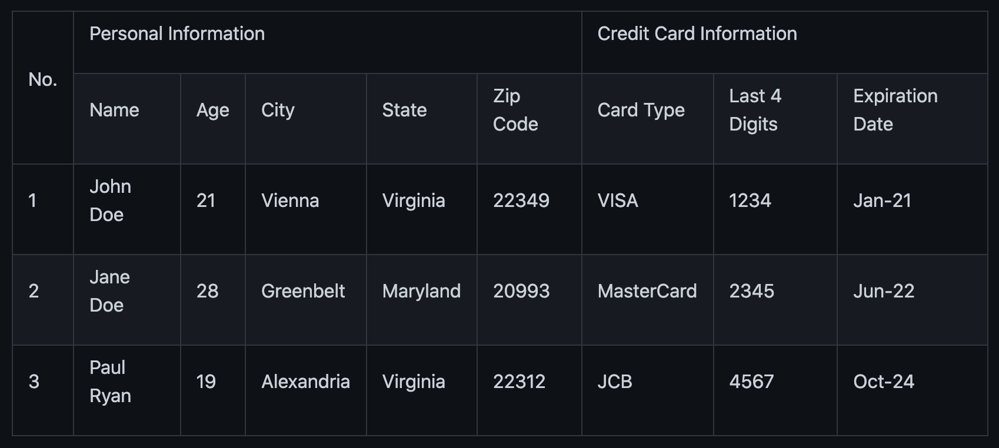

# Annotations

Create your object model:

```java 
public class Employee {

    @ExcelRow                    <1>
    private int rowIndex;

    @ExcelCell(0)                <2>
    private long employeeId;     <3>

    @ExcelCell(1)
    private String name;

    @ExcelCell(2)
    private String surname;

    @ExcelCell(3)
    private int age;

    @ExcelCell(4)
    private boolean single;

    @ExcelCellName("emails")     <4>
    List<String> emails;

    @ExcelCell(5)
    List<BigDecimal> bills;

    //no need getters/setters to map excel cells to fields
}
````
1. Optionally, we can access the index of each row item by using the `ExcelRow` annotation. Annotated variable should be of type `int`, `double`, `float` or `long`.
2. A field must be annotated with `@ExcelCell` along with its property in order to get the value from the right coordinate in the target excel sheet.
3. An annotated field can be either protected, private or public modifier. The field may be either of `boolean`, `int`, `long`, `float`, `double`, or their wrapper classes. You can add a field of `java.util.Date`, `java.time.LocalDate`, `java.time.LocalDateTime` and `String` as well.
4. If one column contains multiple value, you can get them using a List field. A List field can store items which is of type `BigDecimal`, `Long`, `Double`, `Float`, `Integer`, `Boolean` and `String`.

This is the excel file (`employees.xlsx`) we want to map to a list of `Employee` instance:


|ID | NAME |SURNAME |AGE |SINGLE |BILLS | EMAILS|
|--|--|--|--|--|--|--|
|123923 |Joe |Doe |30 |TRUE |123,10;99.99 |joe@doe.com;joedoe@gmail.com|
|123123|Sophie|Derue|20|TRUE|1022 |sophie.derue@gmail.com;sophie@derue.com|
|135923|Paul|Raul|31|FALSE|73,25;70|paul.raul@gmail.com;paul@raul.com|


The snippet below shows how to obtain the excel data using `Poiji`.

```java
PoijiOptions options = PoijiOptions.PoijiOptionsBuilder.settings()
        .addListDelimiter(";") <1>
        .build();
List<Employee> employees = Poiji.fromExcel(new File("employees.xls"), Employee.class, options);
// alternatively
InputStream stream = new FileInputStream(new File("employees.xls"))
List<Employee> employees = Poiji.fromExcel(stream, PoijiExcelType.XLS, Employee.class, options);

employees.size();
// 3
Employee firstEmployee = employees.get(0);
// Employee{rowIndex=1, employeeId=123923, name='Joe', surname='Doe', age=30, single=true, emails=[joe@doe.com, joedoe@gmail.com], biils=[123,10, 99.99]}
```

1. By default the delimiter/separator is `,` to split items in a cell. There is an option to change this behavior. Since we use `;` between items, we need to tell Poiji to use `;` as a separator.

By default, Poiji ignores the header row of the excel data. If you want to ignore the first row of data, you need to use `PoijiOptions`.

```java
PoijiOptions options = PoijiOptionsBuilder.settings(1).build(); // we eliminate Joe Doe.
List<Employee> employees = Poiji.fromExcel(new File("employees.xls"), Employee.class, options);
Employee firstEmployee = employees.get(0);
// Employee{rowIndex=2, employeeId=123123, name='Sophie', surname='Derue', age=20, single=true, emails=[sophie.derue@gmail.com, sophie@derue.com], biils=[1022]}
```

By default, Poiji selects the first sheet of an excel file. You can override this behaviour like below:

```java
PoijiOptions options = PoijiOptionsBuilder.settings()
                       .sheetIndex(1) <1>
                       .build();
```

1. Poiji should look at the second (zero-based index) sheet of your excel file.

## ExcelCellName

Using ExcelCellName, we can read the values by column names directly.

```java
public class Person {

    @ExcelCellName("Name")  (1)
    protected String name;

    @ExcelCellName("Address")
    protected String address;

    @ExcelCellName("Age")
    protected int age;

    @ExcelCellName("Email")
    protected String email;

}
```

1. We need to specify the name of the column for which the corresponding value is looked. By default, `@ExcelCellName` is case-sensitive and the excel file should’t contain duplicated column names. However, you can manipulate this feature using `PoijiOptionsBuilder#caseInsensitive(boolean)` and you can ignore white spaces using `PoijiOptionsBuilder#ignoreWhitespaces(boolean)`.

For example, here is the excel (`person.xls`) file we want to use:


|Name|    Address| Age| Email|
|---|---|---|--|
|Joe  |San Francisco, CA|30|joe@doe.com|
|Sophie|Costa Mesa, CA|20|sophie@doe.com|


```java
List<Person> people = Poiji.fromExcel(new File("person.xls"), Person.class);
people.size();
// 2
Person person = people.get(0);
// Joe
// San Francisco, CA
// 30
// joe@doe.com
```
Given that the first column always stands for the names of people, you’re able to combine the ExcelCell annotation with `ExcelCellName`  in your object model:

```java
public class Person {

    @ExcelCell(0)
    protected String name;

    @ExcelCellName("Address")
    protected String address;

    @ExcelCellName("Age")
    protected int age;

    @ExcelCellName("Email")
    protected String email;

}
```

## ExcelCellRange

Consider you have a table like below:




The `ExcelCellRange` annotation lets us aggregate a range of information in one object model. In this case, we collect the data in `PersonCreditInfo` plus details of the person in `PersonInfo` and for the credit card in `CardInfo`:

```java
public class PersonCreditInfo {

    @ExcelCellName("No.")
    private Integer no;

    @ExcelCellRange
    private PersonInfo personInfo;

    @ExcelCellRange
    private CardInfo cardInfo;

    public static class PersonInfo {
        @ExcelCellName("Name")
        private String name;
        @ExcelCellName("Age")
        private Integer age;
        @ExcelCellName("City")
        private String city;
        @ExcelCellName("State")
        private String state;
        @ExcelCellName("Zip Code")
        private String zipCode;
    }

    public static class CardInfo {
        @ExcelCellName("Card Type")
        private String type;
        @ExcelCellName("Last 4 Digits")
        private String last4Digits;
        @ExcelCellName("Expiration Date")
        private String expirationDate;
    }
}
```

Using the conventional way, we can retrieve the data using `Poiji.fromExcel`:

```java
PoijiOptions options = PoijiOptions.PoijiOptionsBuilder.settings().headerCount(2).build();
List<PersonCreditInfo> actualPersonalCredits = Poiji.fromExcel(new File(path), PersonCreditInfo.class, options);

PersonCreditInfo personCreditInfo1 = actualPersonalCredits.get(0);
PersonCreditInfo.PersonInfo expectedPerson1 = personCreditInfo1.getPersonInfo();
PersonCreditInfo.CardInfo expectedCard1 = personCreditInfo1.getCardInfo();
```

